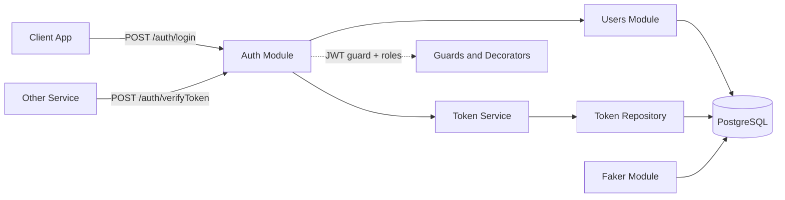

<div align="center">

# secNotify-BEnd


**A NestJS authentication and identity backend that issues JWT access and refresh tokens, verifies them for other services, and manages users with role based access.**

</div>

> [!NOTE]
> This is the active backend code from the `dec-release` branch. The default `main` branch held only placeholder files. This branch is the source of truth for the running service.

## Table of Contents

- [About](#about)
- [Features](#features)
- [Tech Stack](#tech-stack)
- [Architecture](#architecture)
- [Getting Started](#getting-started)
- [Key Endpoints](#key-endpoints)
- [Project Structure](#project-structure)
- [Configuration](#configuration)
- [Roadmap](#roadmap)
- [Contributing](#contributing)
- [License](#license)

## About

`secNotify-BEnd` is the authentication core for the Secure Notify platform. It handles user login, hashes passwords with bcrypt, and creates JSON Web Tokens that are stored in the database for each session. Other services in the platform send their tokens to this backend to be verified, so it acts as a shared source of identity for the wider system.

The service is built on NestJS with TypeORM over PostgreSQL. It models three roles (admin, user, and rider) and uses guards and decorators to protect routes. A faker module is included to seed the database with demo users so the app can be tried end to end without manual data entry.

The package name in `package.json` is `secure-notify-core`, which reflects this role as the identity core of the platform.

## Features

- Email or username login that returns access and refresh tokens.
- Password hashing with bcrypt and account lockout fields (failed attempts, blocked until).
- Database backed tokens with session tracking; logging in clears other sessions for the same user.
- Token verification endpoints, including a diagnostic endpoint for troubleshooting JWT secrets.
- Role based access control with `ADMIN`, `USER`, and `RIDER` roles via guards and decorators.
- User and rider management scoped by organization (create, read, update, soft delete).
- A faker module to seed the database with demo users.
- Swagger API documentation served at `/api`.

## Tech Stack

| Layer | Technology |
|-------|------------|
| Runtime | Node.js |
| Framework | NestJS 10 |
| Language | TypeScript 5 |
| Database | PostgreSQL |
| ORM | TypeORM 0.3 |
| Auth | Passport, passport-jwt, `@nestjs/jwt` |
| Hashing | bcryptjs |
| Validation | class-validator, class-transformer |
| API docs | `@nestjs/swagger` |
| Testing | Jest, Supertest |

## Architecture



## Getting Started

### Prerequisites

```bash
node --version   # Node.js 18 or newer
npm --version
# A running PostgreSQL instance
```

### Installation

```bash
git clone https://github.com/atiqbitstream/secNotify-BEnd.git
cd secNotify-BEnd
git checkout dec-release
npm install
```

### Environment

Create a `.local.env` file in the project root. The app reads it through `@nestjs/config` (see `src/app.module.ts`). See [Configuration](#configuration) for the variables.

> [!WARNING]
> Do not commit real secrets. See the security note in [Configuration](#configuration).

### Run

```bash
npm run start:dev     # watch mode
npm run start         # standard
npm run build         # compile to dist/
npm run start:prod    # run the compiled build
```

The service listens on **port 3000**. Swagger UI is available at `http://localhost:3000/api`.

### Test

```bash
npm run test          # unit tests
npm run test:e2e      # end to end tests
npm run test:cov      # coverage
```

## Key Endpoints

| Method | Path | Access | Description |
|--------|------|--------|-------------|
| POST | `/auth/login` | Public | Log in with email or username and password; returns access and refresh tokens plus the user. |
| POST | `/auth/verifyToken` | JWT guard | Verify a bearer token and return its decoded payload. |
| POST | `/auth/diagnosticToken` | Public | Diagnostic check of a token against the access secret. |
| POST | `/user/signup` | Public | Create a new user account. |
| POST | `/user/createAsRider` | Admin | Create a user with the rider role. |
| GET | `/user/getAsRider` | Admin, Rider | Fetch a single rider by id within the caller's organization. |
| GET | `/user/getAllRiders` | Admin, Rider | List riders for an organization. |
| PATCH | `/user/updateRider/:id` | JWT guard | Update a rider in the caller's organization. |
| DELETE | `/user/deleteRider/:id` | Admin, Rider | Soft delete a rider in the caller's organization. |
| GET | `/user/profile` | Admin | Return the current authenticated user. |
| POST | `/user/logout` | JWT guard | Remove the current user's tokens. |
| POST | `/faker` | Public | Seed the database with demo users. |

## Project Structure

```text
src/
  app.module.ts          Root module, TypeORM and config wiring
  main.ts                Bootstrap, CORS, Swagger, port 3000
  auth/                  Login, JWT strategy, guards, decorators, entities
    services/            AuthService (login, validate user)
    guards/              JwtAuthGuard, RolesGuard
    decorators/          @Public, @Roles, @CurrentUser
    entities/            Account, Token, Password2fa
    strategies/          JwtStrategy
  shared/                TokenService and TokenRepository (shared module)
  users/                 User entity, DTOs, controller, service, roles enum
  faker/                 Demo data seeding module
  utils/                 Dates, constants, error messages, reset helpers
test/                    End to end tests
```

## Configuration

The app loads environment variables from `.local.env` via `@nestjs/config`. The variables read in code are:

| Variable | Description |
|----------|-------------|
| `DB_HOST` | PostgreSQL host |
| `DB_PORT` | PostgreSQL port |
| `DB_USERNAME` | Database user |
| `DB_PASSWORD` | Database password |
| `DB_DATABASE` | Database name |
| `JWT_ACCESS_SECRET` | Secret used to sign and verify access tokens |
| `JWT_REFRESH_SECRET` | Secret used to sign refresh tokens |
| `JWT_ACCESS_EXPIRATION` | Access token lifetime in seconds |
| `JWT_REFRESH_EXPIRATION` | Refresh token lifetime in seconds |

> [!CAUTION]
> A `.local.env` file with real database credentials and JWT secrets is committed to this branch. Treat those values as compromised: rotate the database password and both JWT secrets, remove the file from version control, add it to `.gitignore`, and provide a `.local.env.example` with placeholder values instead. The current `.gitignore` ignores `.env` and `.env.local` but not `.local.env`, which is why the file was tracked.

## Roadmap

- [ ] Stop committing `.local.env`; ship a `.local.env.example` and rotate all secrets.
- [ ] Add a refresh token rotation endpoint (the logic is drafted but commented out).
- [ ] Restrict CORS to known frontend origins instead of `*`.
- [ ] Re-enable JWT expiration checking in the strategy (`ignoreExpiration` is currently true).
- [ ] Replace `synchronize: true` with managed migrations for production.
- [ ] Add a real Swagger title and description in place of the placeholder text.

## Contributing

Contributions are welcome. Open an issue to discuss a change, then submit a pull request against the active release branch.

## License

Distributed under the MIT License. See [LICENSE](LICENSE).
